# XAUUSD Volatility Classifier

## Overview
This is a PyTorch-based Deep Neural Network binary classifier designed to act as a production-grade, pre-trade execution filter for algorithmic trading systems. It processes sequential 5-candle OHLCV windows to estimate imminent market regime distributions, filtering out low-probability environments.


## How it Works

```mermaid
graph LR
    A[Data Engine<br/>5 OHLCV Candles<br/>25 Features] --> B(Layer 1: Linear 64 + ReLU)
    B --> C(Layer 2: Linear 32 + ReLU)
    C --> D(Output Layer: Linear 1 + Sigmoid)
    D --> E{Prediction Score}
    E -->|> 50%| F((EXPANSION))
    E -->|< 50%| G((CONSOLIDATION))
    
    style A fill:#6a329f
    style F fill:#073763
    style G fill:#660000
```


## Architecture & Data Logic
* **Feature Processing Layer:** Takes 25 features representing a flattened time-series sequence of 5 sequential candles (each containing Open, High, Low, Close, and Volume fields).
* **Target Mapping Strategy:** Dynamically isolates the close prices inside each data series window (`X[s, 3::5]`). It computes sequential log returns and extracts the standard deviation over the sequence. The sequence is labeled as `1.0` (Expansion / High Volatility Environment) if the standard deviation passes our variance boundary limit (`0.0012`), and `0.0` (Consolidation / Calm Market State) if it falls below it.
* **Network Layers:** Fully connected feed-forward architecture mapping dimensions dynamically via centralized configuration environments (`config.py`).
* **Activations & Outputs:** Uses rectified linear units (`ReLU`) across hidden nodes to capture non-linear relationships. It maps the final layer output through a `Sigmoid` activation function to compress values into an explicit probability score bounded between `[0, 1]`.
* **Loss Function Configuration:** Binary Cross-Entropy Loss (`BCELoss`), optimization mapped via the Adam algorithm at a structured configuration footprint of `lr=0.01`.

## Getting Started
### 1. Installation
This repository uses standard PEP 517 packaging layouts. Install the production dependencies or local development tools directly from the root package manifest:
```bash
# Install core runtime dependencies
pip install -e .

# Install development, quality check, and testing toolsets
pip install -e .[dev]
```

## How to Run
1. Install dependencies: `pip install torch numpy`
2. Run the full pipeline: `python test.py`

## Role in the Omni-Agent Ecosystem
This component serves as a defensive pre-trade firewall inside high-fidelity execution frameworks. By accurately blocking order placement actions during sideways consolidation periods, it minimizes drawdowns caused by false break-out signals.