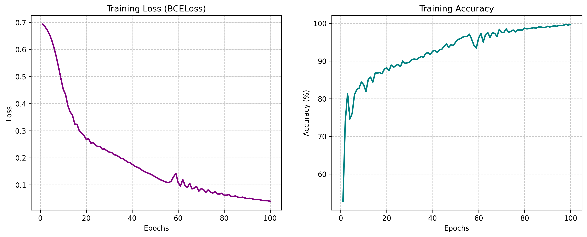

# XAUUSD Volatility Classifier

## Overview
This is a PyTorch-based Binary Classifier designed to act as a pre-trade filter for an algorithmic trading system. It analyzes the last 5 OHLCV candles of an asset (like XAUUSD) and outputs a probability score predicting imminent market volatility.

## How it Works

```mermaid
graph LR
    A[Data Engine<br/>5 OHLCV Candles<br/>25 Features] --> B(Layer 1: Linear 64 + ReLU)
    B --> C(Layer 2: Linear 32 + ReLU)
    C --> D(Output Layer: Linear 1 + Sigmoid)
    D --> E{Prediction Score}
    E -->|> 50%| F((EXPANSION))
    E -->|< 50%| G((CONSOLIDATION))
    
    style A fill:#6a329f
    style F fill:#073763
    style G fill:#660000
```

## Architecture
* **Inputs:** 25 features (5 sequential candles flattened into a 1D array).
* **Network:** Feed-Forward Deep Neural Network (Dense Layers).
* **Activations:** * `ReLU` for hidden layers to map non-linear price relationships.
  * `Sigmoid` for the output layer to bound predictions to a probability [0, 1].
* **Loss Function:** Binary Cross-Entropy (`BCELoss`).
* **Optimizer:** Adam (`lr=0.01`).

## How to Run
1. Install dependencies: `pip install torch numpy`
2. Run the full pipeline: `python test.py`

## Role in the Omni-Agent Ecosystem
This module prevents trend-following bots from executing during choppy, sideways consolidation periods by filtering out setups with a volatility probability below 50%.